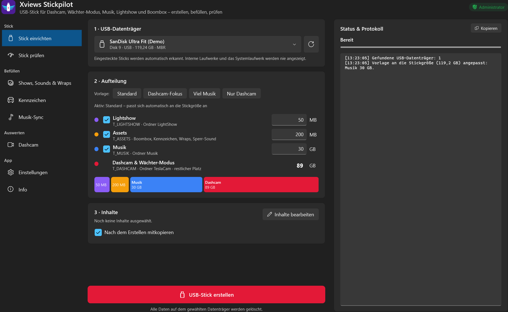
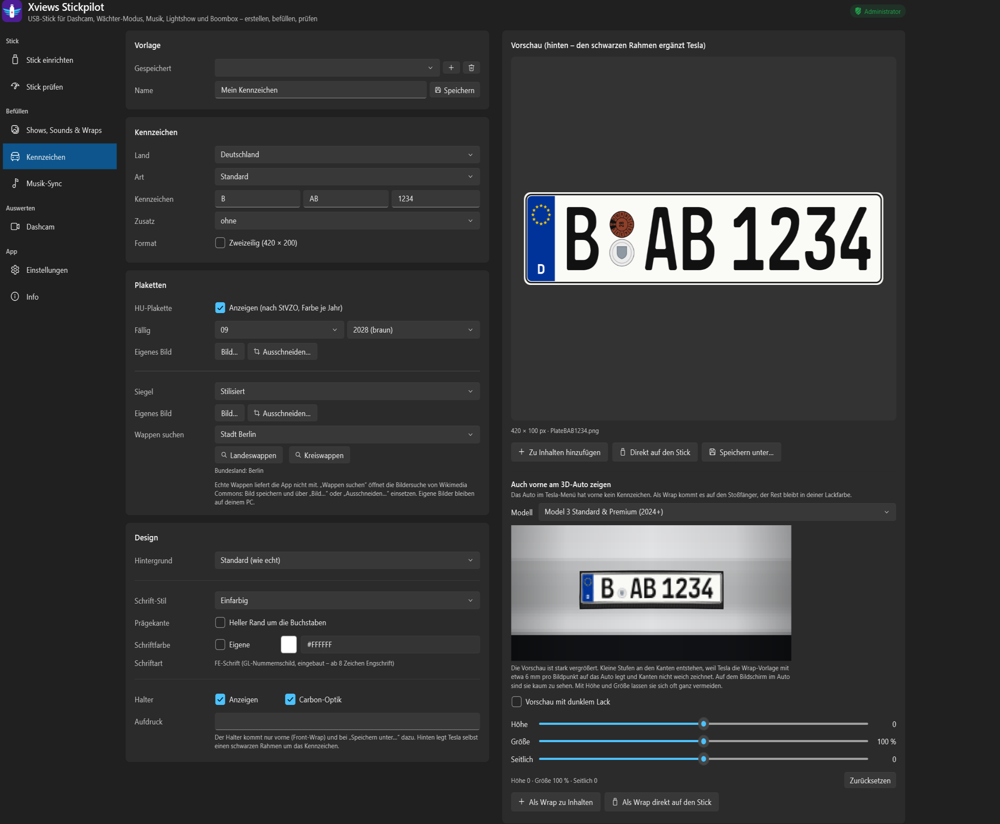
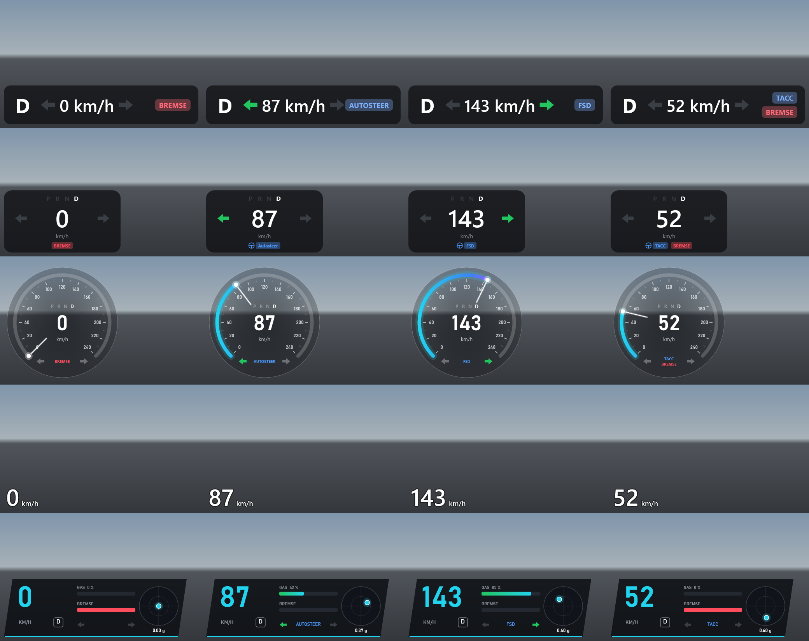
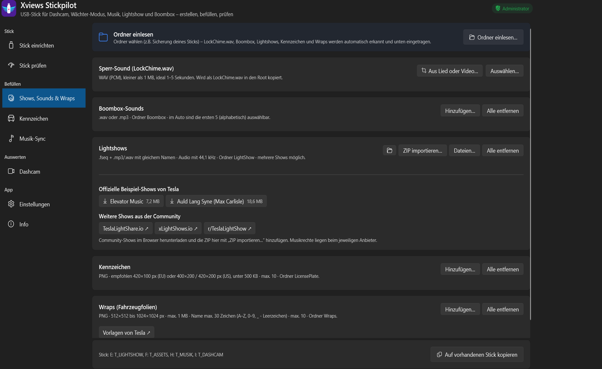

# Xviews Stickpilot

**Der USB-Stick für deinen Tesla, einfach gemacht.** Kostenloses Windows-Tool, das den kompletten Tesla-USB-Stick einrichtet, befüllt und prüft. Dazu gibt es einen Kennzeichen-Generator und einen Dashcam-Viewer mit Fahrdaten.

> Privates Projekt ohne Verbindung zu Tesla, Inc. „Tesla“ ist eine Marke von Tesla, Inc.

## Funktionen

- **Stick einrichten:** Aufteilung für Dashcam und Wächter-Modus, Musik, Lightshow und Boombox. Die Vorlagen (Standard, Dashcam-Fokus, Viel Musik, Nur Dashcam) passen sich automatisch an die Stickgröße an.
- **Stick prüfen:** Geschwindigkeitstest. Tesla verlangt für die Dashcam mindestens 4 MB/s dauerhafte Schreibrate.
- **Shows, Sounds & Wraps:** Lightshows, Boombox-Sounds, Sperr-Sound (LockChime), Wraps und Kennzeichen hinzufügen. Alles wird auf die Tesla-Vorgaben geprüft, Lightshow-Tonspuren werden bei Bedarf auf 44,1 kHz umgewandelt.
- **Kennzeichen-Generator:** Deutschland, Österreich, Schweiz, Niederlande und USA. Deutsche Schilder mit HU-Plakette nach StVZO (Farbe je Jahr), Stempelplakette, Saison-, Kurzzeit- und Ausfuhrkennzeichen, Carbon- oder 3D-Optik.
  - **Front-Kennzeichen als Wrap:** Tesla zeigt am 3D-Auto vorne kein Kennzeichen. Als Wrap kommt es auf den Stoßfänger (Model 3 ab 2024, Model S ab 2021).
  - **Wappen suchen:** Aus dem Ortskürzel werden Kreis und Bundesland ermittelt. Die Suche nach dem passenden Wappen öffnet sich mit einem Klick.
- **Musik-Sync:** Überträgt nur neue und geänderte Titel.
- **Dashcam:** Alle Kameras gleichzeitig, Fahrdaten (km/h, Gang, Blinker, Bremse, Autopilot, GPS), Clips zuschneiden und exportieren. Für die Fahrdaten-Einblendung im Export gibt es fünf Designs: Klassisch, Tesla-Stil, analoger Tacho, Minimal und Sport-HUD.

## Download

➡️ **[Neueste Version unter „Releases“](../../releases/latest)**

| Datei | Größe | Hinweis |
|---|---|---|
| `XviewsStickpilot.exe` | ca. 72 MB | läuft sofort, keine Installation |
| `XviewsStickpilot-klein-benoetigt-dotnet10.exe` | ca. 28 MB | braucht die [.NET 10 Desktop Runtime](https://dotnet.microsoft.com/download/dotnet/10.0) |

**Voraussetzungen:** Windows 10 oder 11 (64 Bit).

**Beim ersten Start:**
- Windows fragt nach **Adminrechten**. Die braucht Windows zum Formatieren des Sticks.
- Meldet SmartScreen „Unbekannter Herausgeber“, auf **„Weitere Informationen“** und dann auf **„Trotzdem ausführen“** klicken. Die EXE ist nicht signiert, weil ein Zertifikat Geld kostet.
- Einstellungen und Bibliothek liegen im Ordner `XviewsStickpilot` neben der EXE.

## Wichtig

- Beim Einrichten wird der Stick **gelöscht**, wenn du die vorhandenen Inhalte nicht behältst. Also vorher sichern.
- Nutzung auf eigene Verantwortung.
- Das Tool sendet keine Daten. Ins Internet geht es nur, wenn du selbst etwas anstößt, zum Beispiel Beispiel-Lightshows herunterladen oder die Wappen-Suche öffnen.

## Fehler melden

Fehler und Wünsche gerne unter **[Issues](../../issues)**, am besten mit Screenshot und Windows-Version.

## Nutzungsbedingungen

Xviews Stickpilot ist **kostenlos für die private Nutzung**. Die unveränderte Weitergabe der Programmdatei ist erlaubt.

Nicht gestattet sind: der Verkauf, das Verändern des Programms, das Zurückentwickeln (Dekompilieren, Disassemblieren), die Übernahme von Programmcode oder Teilen davon in andere Software sowie das Einspeisen des Programms oder seines Codes in KI-Systeme, um es zu analysieren oder nachzubauen.

© 2026 Xviews. Alle Rechte vorbehalten.

## Verwendete Komponenten & Quellen

- [GL-Nummernschild](https://github.com/Gutenberg-Labo/GL-Nummernschild) (FE-Schrift), © Gutenberg Labo, freie Lizenz
- [Tesla-Dashcam-Datenformat](https://github.com/teslamotors/dashcam), öffentlich beschrieben von Tesla, eigener Leser
- [Tesla-Vorgaben für Wraps & Lightshows](https://github.com/teslamotors), öffentliche Anleitungen von Tesla
- HU-Plakette nachgezeichnet nach [StVZO Anlage IX](https://www.gesetze-im-internet.de/stvzo_2012/anlage_ix.html)
- Kfz-Kürzel und Zulassungsbezirke: Quelle [Kraftfahrt-Bundesamt](https://www.kba.de/DE/Themen/ZentraleRegister/ZFZR/zfzr_node.html)
- Kreise und Bundesländer: Quelle [Statistisches Bundesamt (Destatis)](https://www.destatis.de/DE/Themen/Laender-Regionen/Regionales/Gemeindeverzeichnis/Administrativ/04-kreise.html), [Datenlizenz Deutschland, Namensnennung 2.0](https://www.govdata.de/dl-de/by-2-0)
- [CommunityToolkit.Mvvm](https://github.com/CommunityToolkit/dotnet), [NAudio](https://github.com/naudio/NAudio), [.NET / WPF](https://github.com/dotnet/wpf), jeweils MIT-Lizenz

Die vollständigen Lizenztexte stehen in der App unter **Info → Lizenzen anzeigen**.
